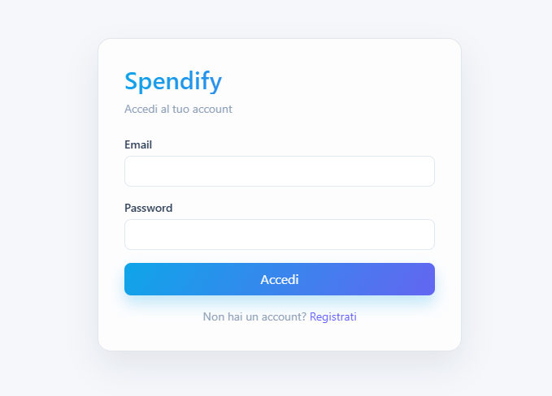

# Spendify

Una web app fullstack per gestire entrate e uscite con dashboard interattiva, analisi avanzate e una UI moderna. Autenticazione con email e password, dati persistenti su database e deploy su cloud.

## Demo

Live: [spendify-app.netlify.app](https://spendify-app.netlify.app/)

### Login


Autenticazione con email e password. Sessione persistente tramite token.

### Dashboard — Analisi e trend


Trend mensili di entrate, uscite e saldo netto con grafici interattivi.

### Dashboard — Confronto mensile


Confronto con il mese precedente e analisi per categoria.

### Dashboard — Transazioni


Ricerca, filtri avanzati, ordinamento colonne e CRUD completo delle transazioni.

## Funzionalità principali

- Autenticazione con registrazione e login (email + password)
- Dashboard completa con KPI, trend mensili e breakdown per categoria
- Grafici interattivi (andamento entrate/uscite, torta per categoria)
- Ricerca e filtri combinabili per tipo, data e testo
- Ordinamento per qualsiasi colonna
- Aggiunta, modifica ed eliminazione transazioni
- Export CSV e JSON di tutte le transazioni
- Dark / Light mode con preferenza salvata
- Dati persistenti su database PostgreSQL

## Tech Stack

### Frontend
- React 19 + Vite
- Tailwind CSS v4
- Recharts
- Lucide Icons
- Axios
- React Router

### Backend
- Laravel 11
- Laravel Sanctum (autenticazione token)
- PostgreSQL

### Infrastructure
- Docker + Docker Compose (sviluppo locale)
- Netlify (frontend)
- Render (backend)
- Neon (database PostgreSQL)

## Avvio locale con Docker

```bash
docker compose up --build
```

App disponibile su [http://localhost:5173](http://localhost:5173)

## Struttura del progetto

```
spendify/
├── docker-compose.yml
├── frontend/               # React + Vite
│   ├── src/
│   │   ├── api/            # Axios client
│   │   ├── context/        # AuthContext
│   │   ├── hook/           # useAuth, useTransactions
│   │   ├── pages/          # LoginPage, RegisterPage
│   │   └── components/     # UI components
│   └── ...
└── backend/                # Laravel 11
    ├── app/
    │   ├── Http/Controllers/
    │   └── Models/
    ├── database/migrations/
    └── routes/api.php
```
