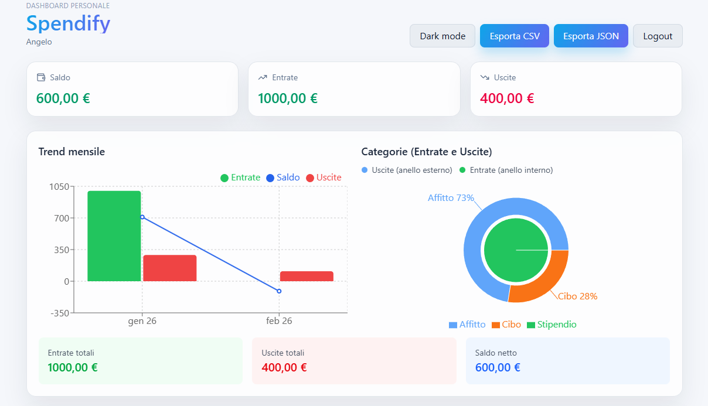
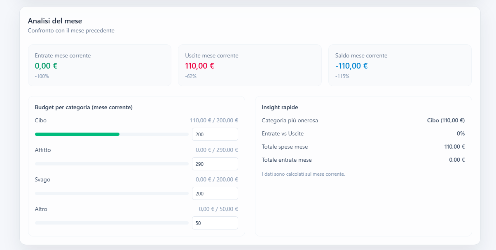
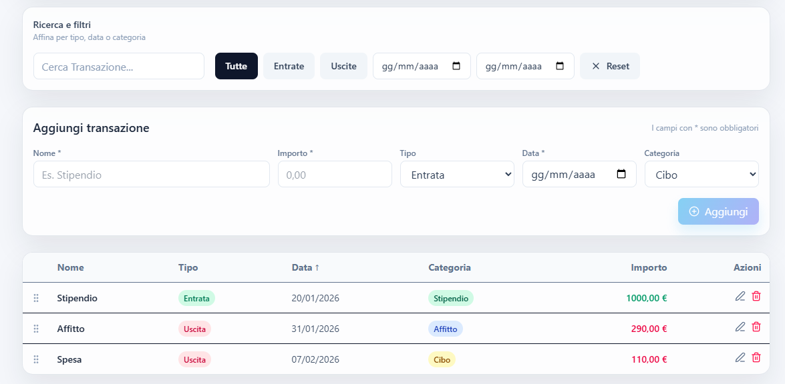

# Expense Tracker

Una web app completa per gestire entrate e uscite con dashboard interattiva, analisi avanzate e una UI moderna. Pensata per essere veloce, chiara e piacevole da usare anche con molti dati.

## Demo

- Live: [spendify-app](https://spendify-app.netlify.app/)

### 📊 Analisi e trend


Trend mensili di entrate, uscite e saldo netto con grafici interattivi.

### 📈 Confronto mensile e budget


Confronto con il mese precedente e gestione dei budget per categoria.

### 🔍 Filtri, inserimento e gestione transazioni


Ricerca, filtri avanzati, ordinamento colonne e CRUD delle transazioni.

## Funzionalita principali

- Dashboard completa con KPI, trend mensili e breakdown per categorie
- Grafici interattivi (trend entrate/uscite + saldo, pie per categorie)
- Analisi del mese con confronto al mese precedente
- Budget per categoria con progress bar e salvataggio locale
- Dark/Light mode con toggle
- Ricerca e filtri combinabili per tipo, data e testo
- Export CSV di tutte le transazioni
- Drag & Drop per riordinare la tabella (solo visivo)
- Persistenza locale tramite `localStorage`

## Tech Stack

- React + Vite
- Tailwind CSS v4
- Recharts
- Lucide Icons
- LocalStorage

## Avvio rapido

```bash
npm install
npm run dev
```

## Build

```bash
npm run build
npm run preview
```

## Struttura del progetto

- `src/App.jsx` — layout principale e wiring dei componenti
- `src/components/` — componenti UI, grafici, modali
- `src/hook/useTransactions.js` — logica dati e persistenza

## Note

- Il drag & drop e solo visivo e non salva l ordine
- I dati restano salvati in `localStorage`
